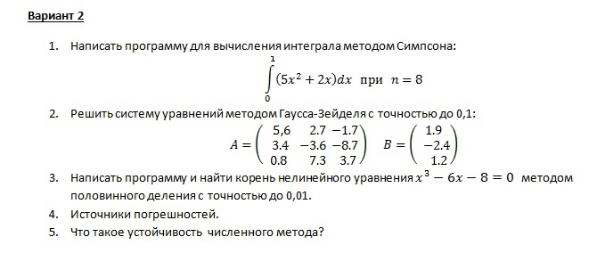
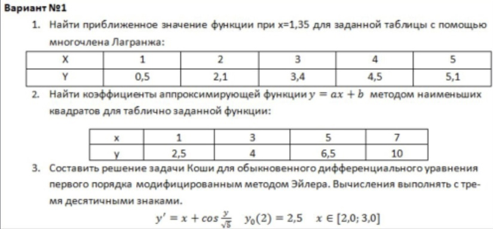

# Вычислительная математика  
Вариант: 9  

+ [Lab 1](./LAB_1) `Python`
+ [Lab 2](./LAB_2) `Python`
+ [Lab 3](./LAB_3) `Python`
+ [Lab 4](./LAB_4) `Python`
+ [Lab 5](./LAB_5) `Python`
+ [Lab 6](./LAB_6) `Python`

## Рубежные тестирования
+ [Рубежка №1](./docs/Вычмат.%20Рубеж%201.pdf)
+ [Рубежка №2](./docs/Вычмат.%20Рубеж%202.pdf)

  
Рубеж 1 (задание)

   

  
Рубеж 2 (задание)

   

