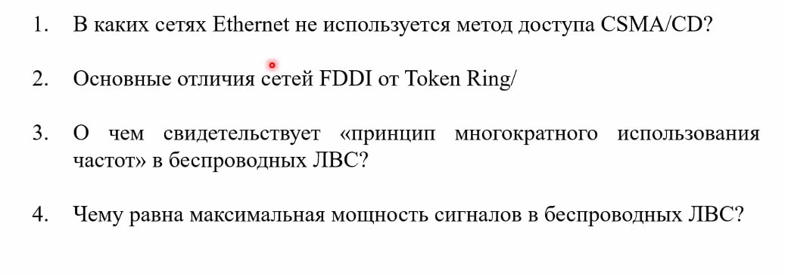
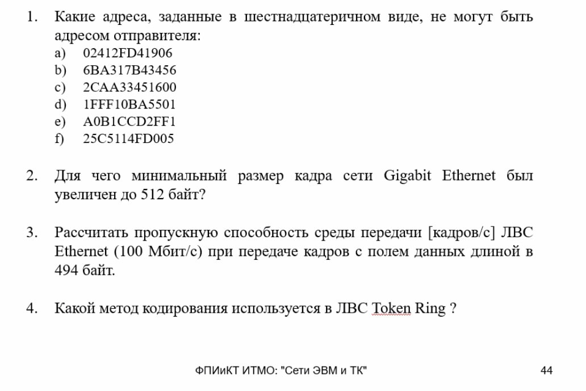
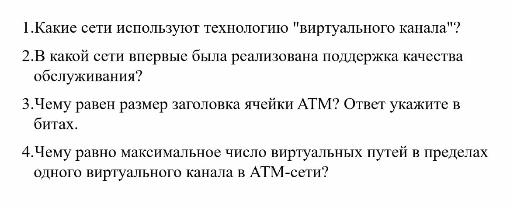

# Компьютерные сети
**Я вас не принуждаю и не советую списывать. Это лишь материалы для ознакомления!!!**  

Если вам уже с самого начала лень делать 1 лабу, вот решатель: [ссылка](https://s265065.github.io/network-lab-solver/)  
Тесты решать лучше всего на 80-100%, чтобы не терять много баллов.

+ [Лабораторная работа 1](./LAB_1)
+ [Лабораторная работа 2](./LAB_2)
+ [Лабораторная работа 3](./LAB_3)
+ [Лабораторная работа 4](./LAB_4)
+ [Лабораторная работа 5](./LAB_5)
+ [Решатель тестов](./nms)
+ [Ответы на все тесты](https://ksgovnoznayte.netlify.app/)
+ [Архив всех тестов](https://disk.yandex.ru/d/n9RuZY3o_xTMmQ)

## Микроконтрольные

  
Тест 1

   

  
Тест 2

   

  
Тест 3

   

## Где находятся эти тесты???
+ Все тесты хранятся на Helios по пути: `cd /export/public/ATI`.
+ За 0-2 дня до вашего тестирования они выкладываются. Но лучше смотреть по расписанию другие группы и во сколько у них пара по времени. Вероятнее всего в это время будет находится тест в папке.

## А можно ли как-то достать базу вопросов из ET1-файла?
+ Да можно :)
+ С помощью данной программы это можно легко сделать: [ссылка](https://disk.yandex.ru/d/l5Ac4Wn-htWunw)