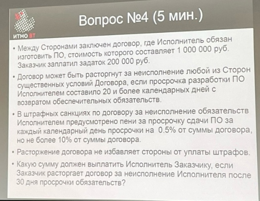

# Экономика программной инженерии
Пьем кофе и считаем налоги.

+ [Лабораторная работа 1](./LAB_1)
+ [Лабораторная работа 2](./LAB_2)
+ [Лабораторная работа 3](./LAB_3)

## Рубежная работа (основная)
### Задание 1
```
Там было 300к цена нашего товара тип, система налогообложения общяя.
Мы используем 2 компании для производства нашего товара.
В одной 72к траты без ндс, во втрой 48к с ндс.
Скок мы должны уплотить ндс?

300к - без ндс тут, 60к будет ндс
_____________________________________
72 и 48к - это входит в стоимость разработки выше
48к - с НДС -> значит ндс = 48000 - 48000 / 1.2 = 8к
72к - без НДС -> значит ндс = 72000 * 0.2 = 14.4к
60 - 8 - 14.4 = 37.6к

Ответ там 37600
```

### Задание 2
```
Трудоемкость разработки ПО составляет 300 попугаев в бэклоге. 
За спринт разработчики отрабатывают 50 попугаев. 
После первого спринта в бэклог было добавлено 20 попугаев, второго 40, третьего 70, а затем в каждый следующий спринт добавлялось по 10 попугаев. 
За сколько спринтов, в соответствии с улучшенной диаграммой сгорания, будет разработано ПО?

300 - (50 - 20) - (50 - 40) - (50 - 70) = 280 (уже 3 дня запомнили)
280 / (50 - 10) = 7 (еще дни запомнили)
7 + 3 = 10

Ответ там 10
```

### Задание 3
```
Дана таблица со сначениями.
Нужно посчитать по методу Перта E (95%)

E1 = (4 * 24 + 24 + 40) / 6 = 80 / 3
E2 = 52 / 3
E3 = 58 / 3
SUM_E = 190 / 3

CKO1 = (8 / 3)^2 = 64 / 9
CKO2 = (4)^2 = 16
CKO3 = (14 / 3)^2 = 196 / 9
SUM_CKO = sqrt( 404 / 9 ) = 2 * sqrt(101) / 3

E(95%) = SUM_E + 2 * SUM_СКО = 190 / 3 + 2 * (2 * sqrt(101) / 3) = 76.73...

Ответ там 77
```

### Задание 4
<details>
  <summary>Открыть</summary>
   
</details>

Задаток возвращается в двойном размере, то есть уже 400к должен.  
Так же штрафы не могу быть в сумме больше 10%.  
Если посчитать то там 100000 по итогу штрафами все равно получится.  
Значит 100000 + 400000 = 500000

Ответ там 500000

### Задание 5
```
Там что-то 40002 нужно было посчитать с налогами.
Нужно учитывать подоходных налог.
Налог на Фонды (дается в задании) + НДС.

Все перемножаем правильно и получаем ответ.

Ответ там 70900
```

## Рубежная работа (перепись)
Не спрашивайте откуда я об этом знаю...  
Будет 4 теор вопросов и практическое задание. Налоги, рассчитать трудоемкость, "Звезда", договоры и что-то ещё.