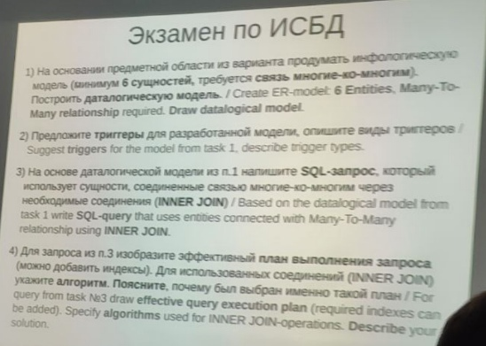

# Информационные системы и базы данных
Теорию можете найти вот здесь: [ссылка](https://rune-dollar-ae8.notion.site/4f3ee55e536b4fffbb96766fb2a7d81e)

+ [Лабораторная работа 1](./LAB_1)
+ [Лабораторная работа 2](./LAB_2)
+ [Лабораторная работа 3](./LAB_3)
+ [Лабораторная работа 4](./LAB_4)
+ [Курсовая работа](./Coursework)
+ [Полезные материалы](./docs)

## Рубежная работа

  
Рубежка 1

   

## Экзамен

  
Экзамен 2021 и 2022

   

