# Операционные системы

+ [Лабораторная работа 1](./LAB_1)
+ [Лабораторная работа 2](./LAB_2)
+ [Полезные материалы](./docs)

## Микроконтрольные

Тесты за 2021 год

  
Тест 1

  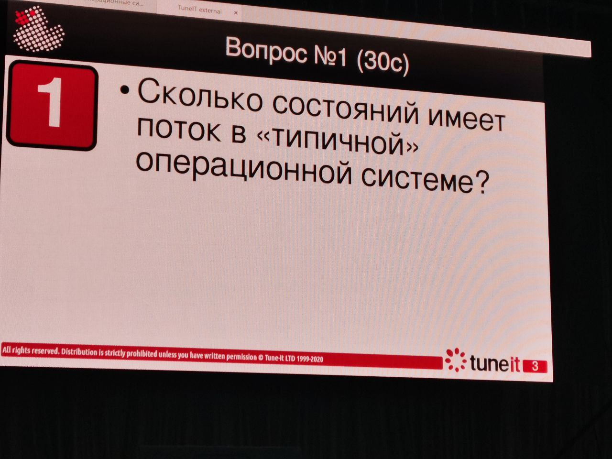
  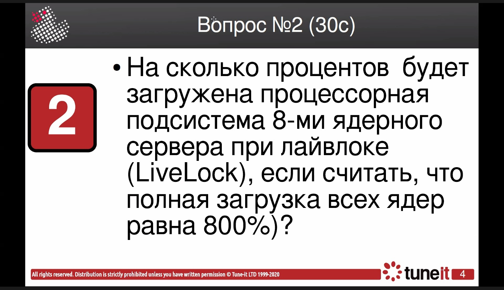 
  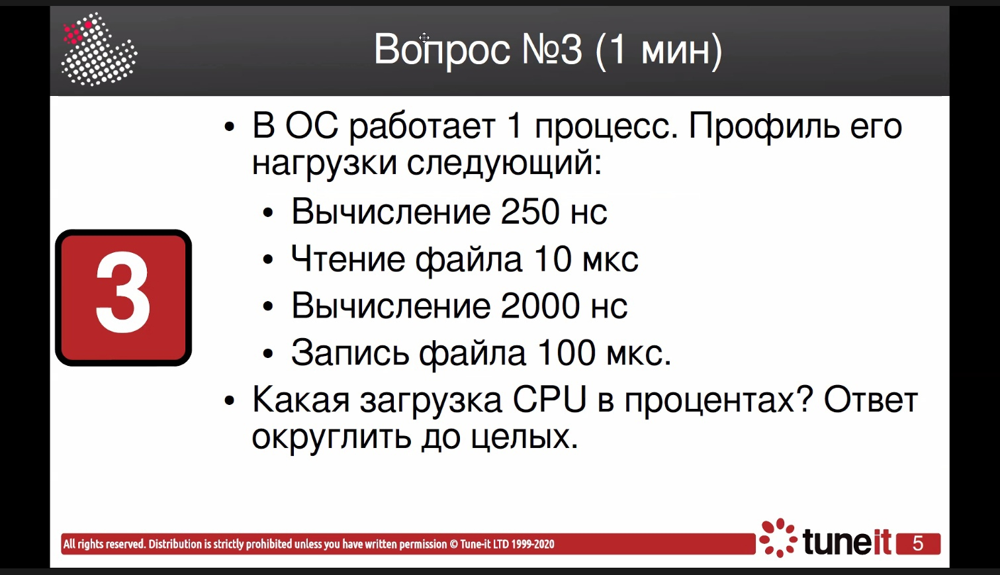 
  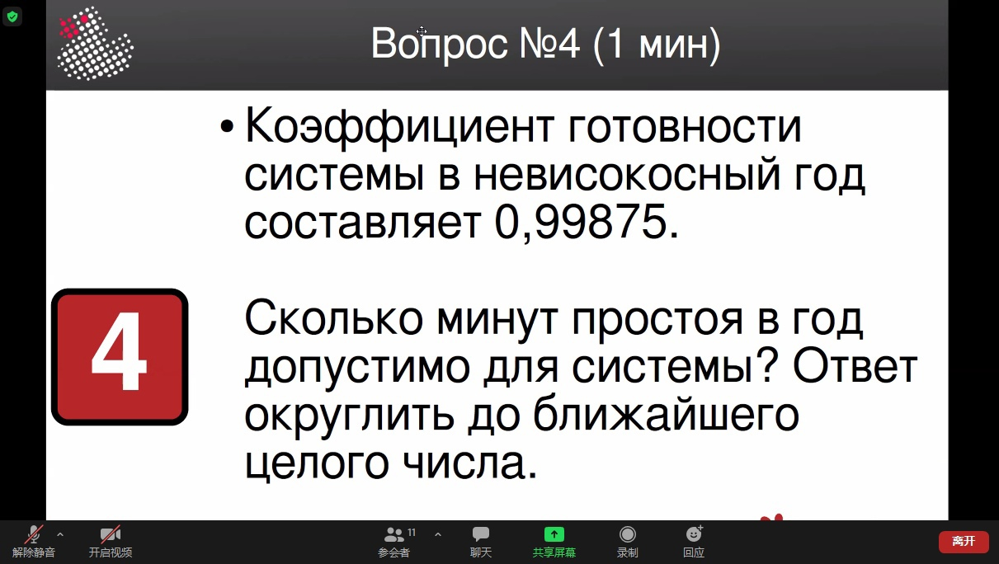 
  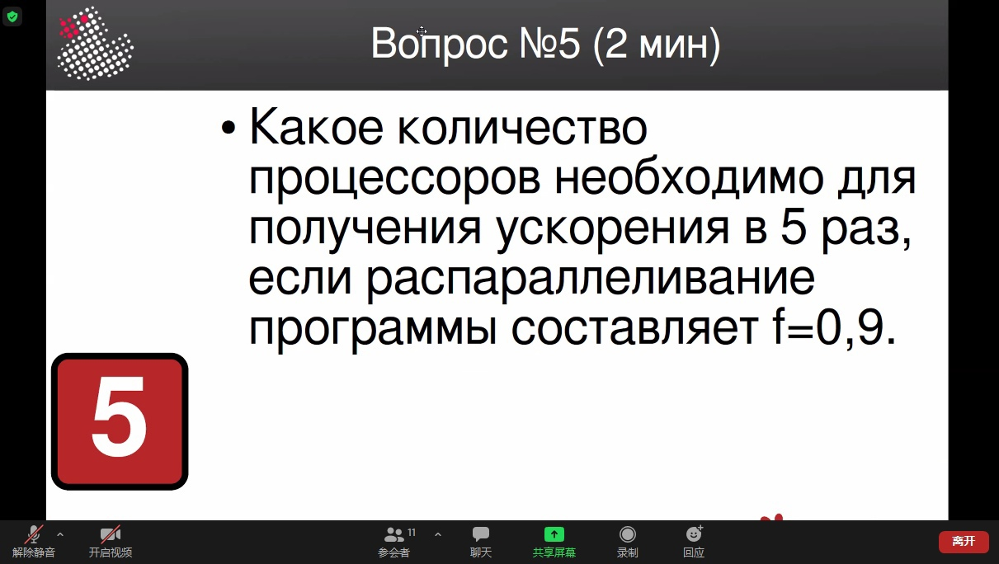 

Ответы:
1. 5
2. 200
3. 2
4. 657
5. 9

  
Тест 2

  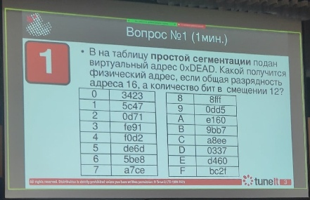 
  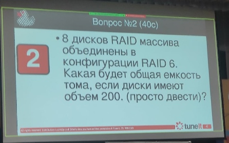 
  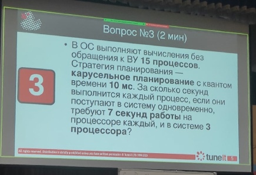 
  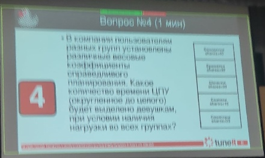 
  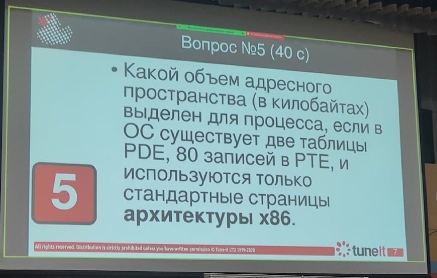 

Ответы:
1. 0x11e4
2. 1200
3. 35
4. 71
5. 40

Тесты за 2022 год

  
Тест 1

  
  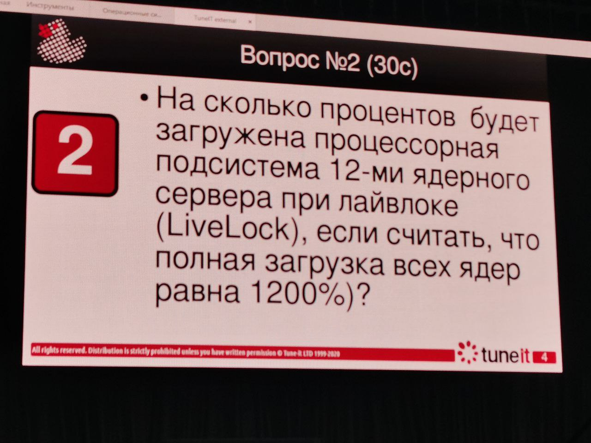 
  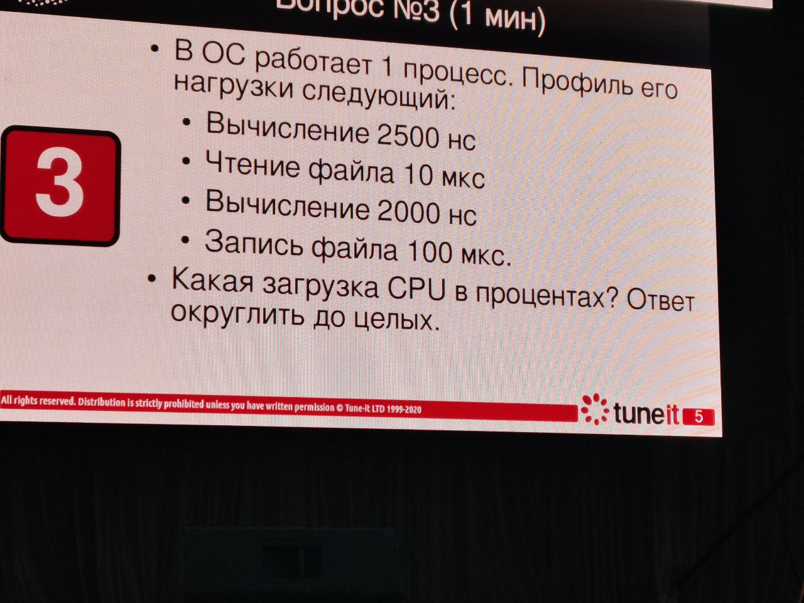 
  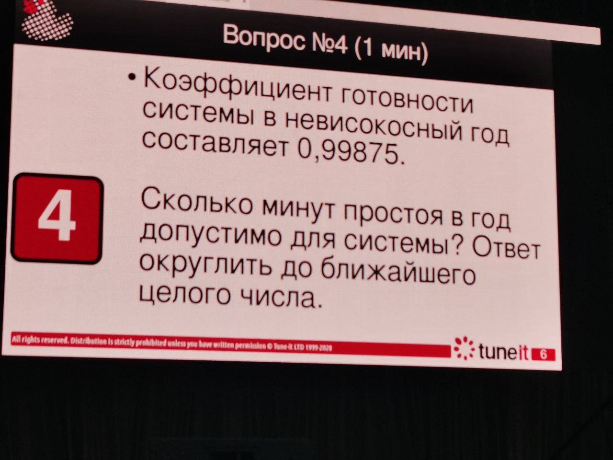 
  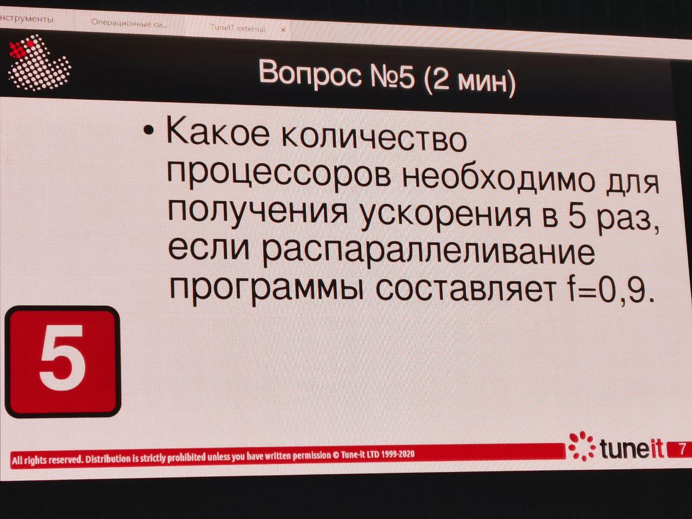

Ответы:
1. 5
2. 200
3. 4
4. 657
5. 9

## Рубежная работа
+ [Решатель задание 1](./tests/task1.py)
+ [Решатель задание 2](./tests/task2.py)
+ [Решатель задание 3](./tests/task3.py)
+ [Разбор заданий - 1](./tests/Рубежка%20OS%20-%20подготовка.pdf)
+ [Разбор заданий - 2](./tests/Для%20своихОС.pdf)

  
Варианты рубежа

  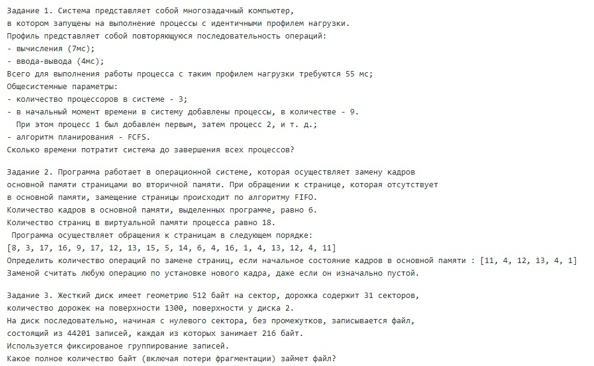
  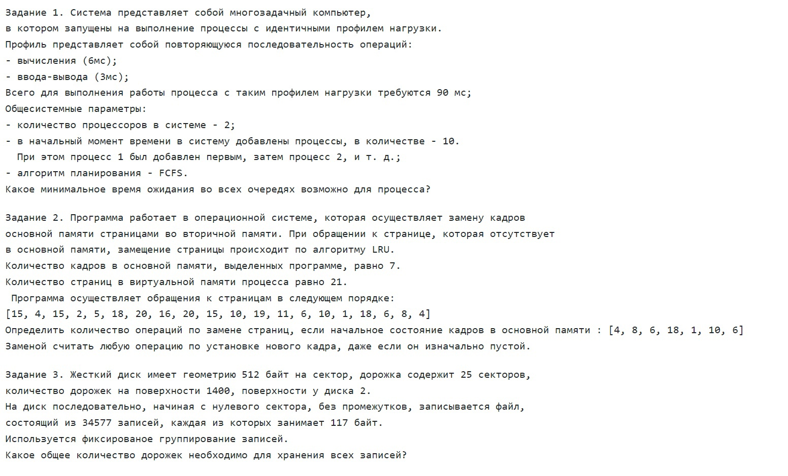 
  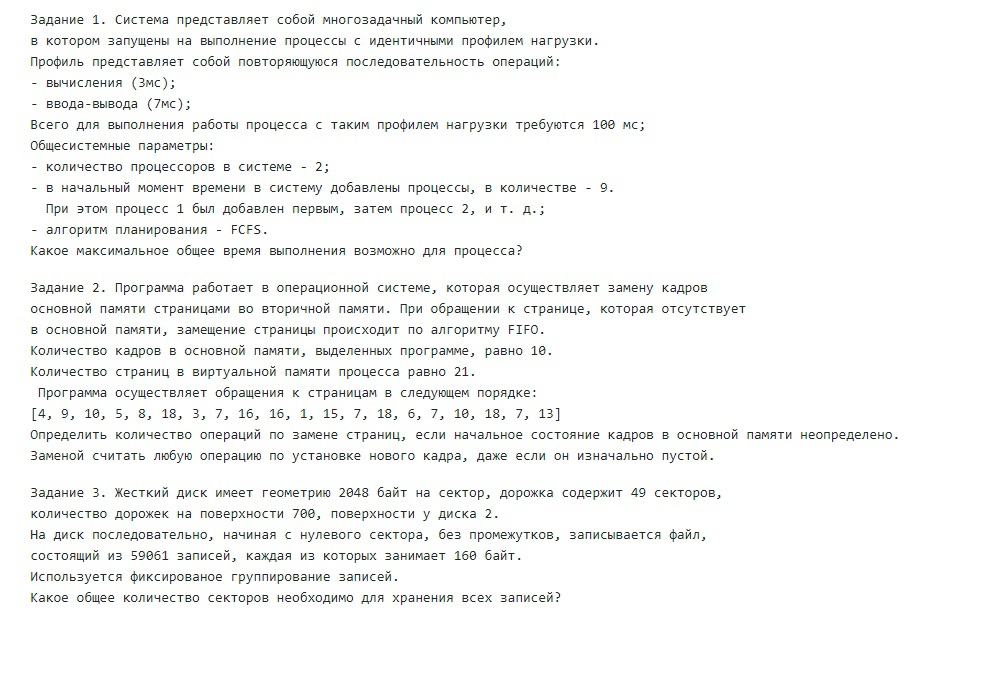 
  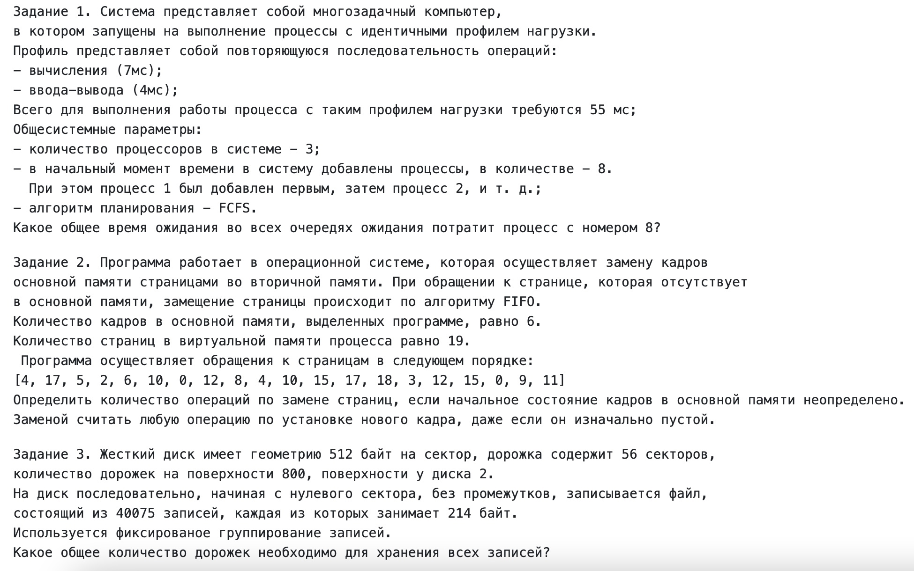 
  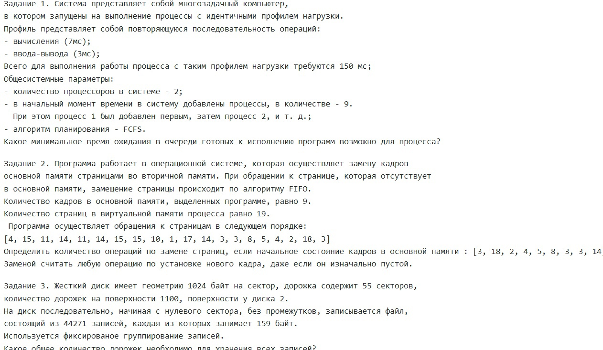

