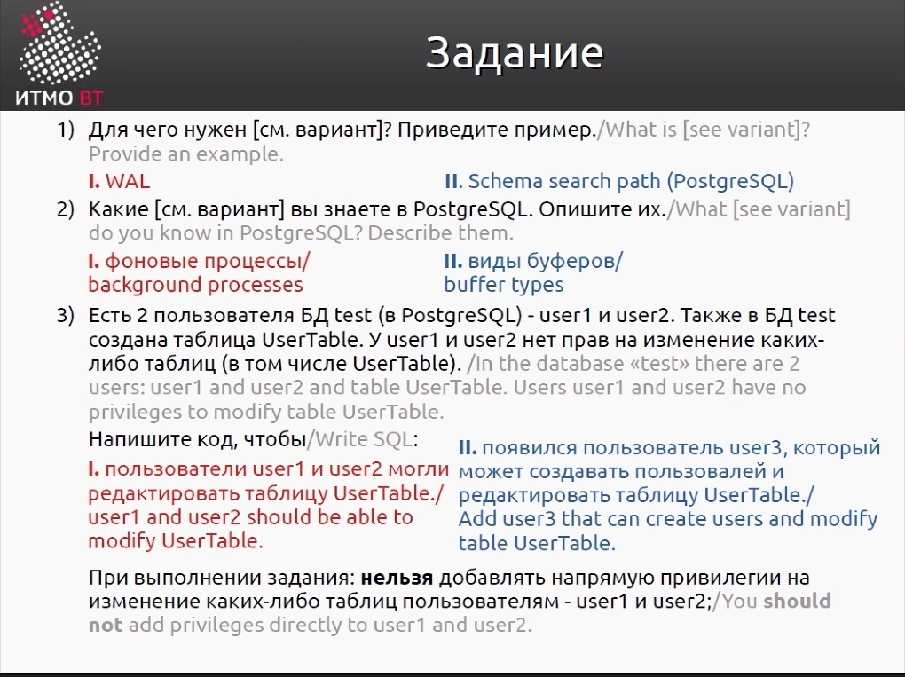
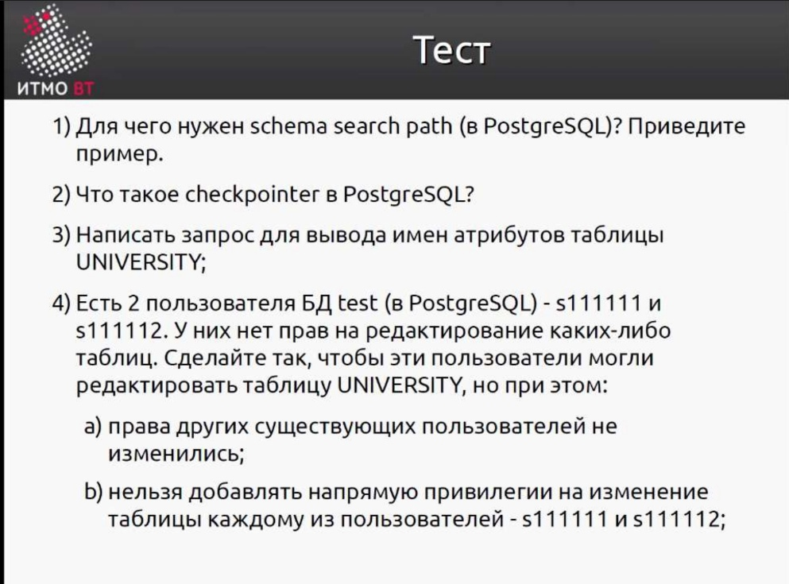
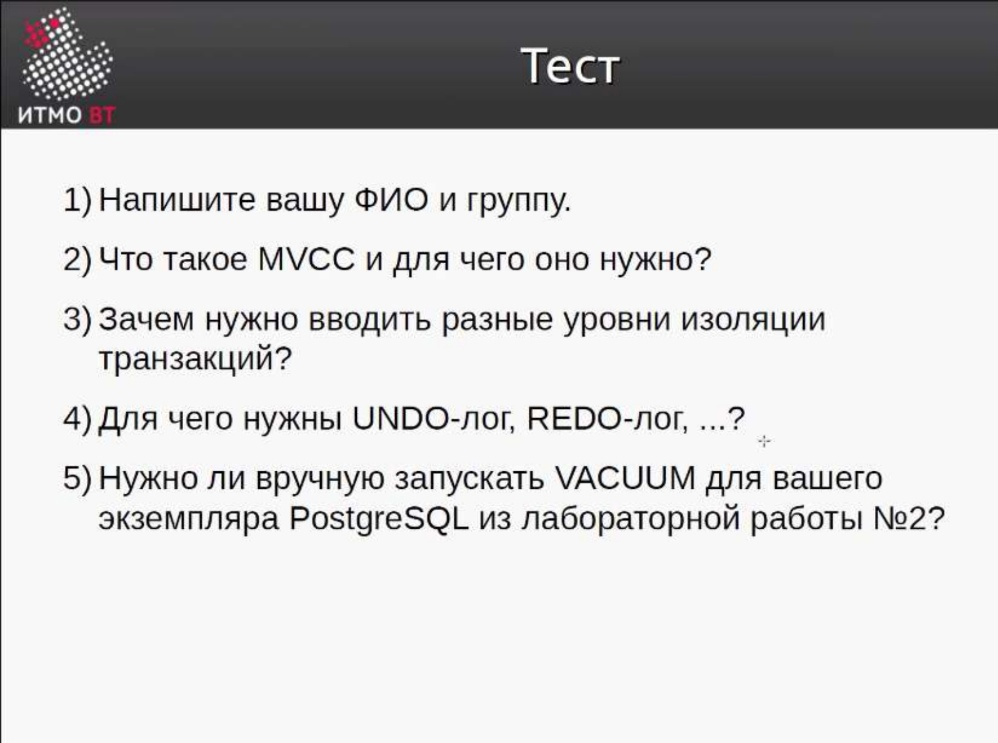
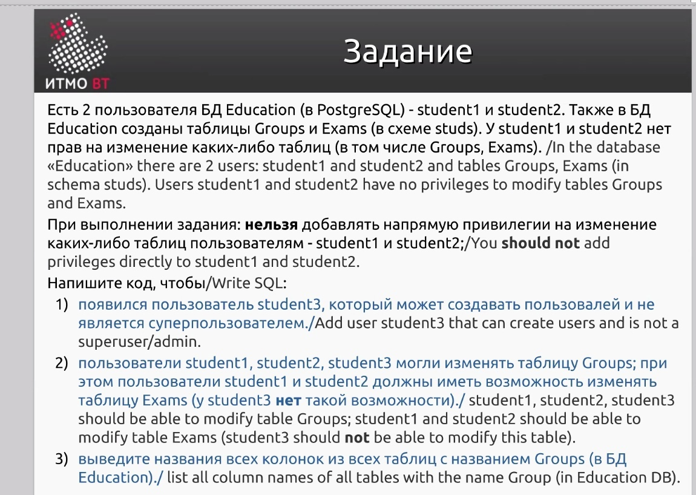

# Распределенные системы хранения данных

+ [Лабораторная работа 1](./LAB_1)
+ [Лабораторная работа 2](./LAB_2)
+ [Лабораторная работа 3](./LAB_3)
+ [Лабораторная работа 4](./LAB_4)
+ [Полезные материалы](./docs)

## Микроконтрольные

  
Тест 1

   

  
Тест 2

   

  
Тест 3

   

  
Тест 4

   

## Рубежная работа

  
Рубежка (вариант 1)

   

## Экзамен (простой)
+ Представляет собой просто 4 теоретических вопроса.  
+ Достаются случайным образом - написал -> свободен.

## Экзамен (сложный)
+ Представляет собой 2 теоретических вопроса как у простого экзамена.    
+ Одно задание на изоляции.  

+ Одно задание на Undo / Redo.  
+ Одно творческое задание на бэкапы. Дано описание какого-то случая с бд и просят написать как это сделать и что-то посчитать. Например размер WAL-файлов примерный за год работы системы.