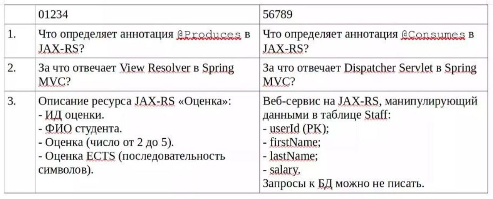

# Сервис-ориентированная архитектура

+ [Лабораторная работа 1](./LAB_1)
+ [Лабораторная работа 2](https://github.com/RedGry/SOA/tree/lab2)
+ [Лабораторная работа 3](https://github.com/RedGry/SOA/tree/lab3)
+ [Лабораторная работа 4](https://github.com/RedGry/SOA/tree/lab4)
+ [Лабораторная работа 4 (видео обзор)](https://disk.yandex.ru/i/kgbnd6KdkMG5RA)
+ [Отчеты + полезные материалы](./docs)

## Микроконтрольные

  
Тест 1

   

  
Тест 2

   
   

  
Тест 3

   

  
Тест 5

   

  
Тест 6

   

## Рубежные тестирования
+ [Рубежная работа 1](./tests/Рубежка%201%20-%20подготовка.pdf)
+ [Рубежная работа 2](./tests/Рубежка%202%20-%20подготовка.pdf)
