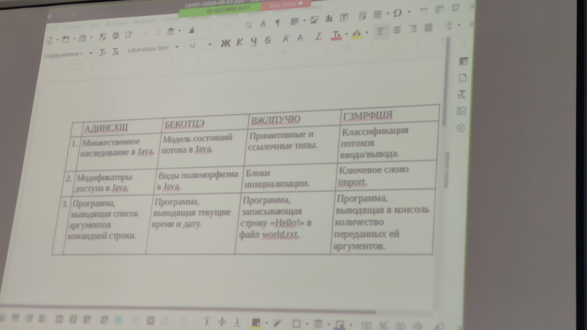
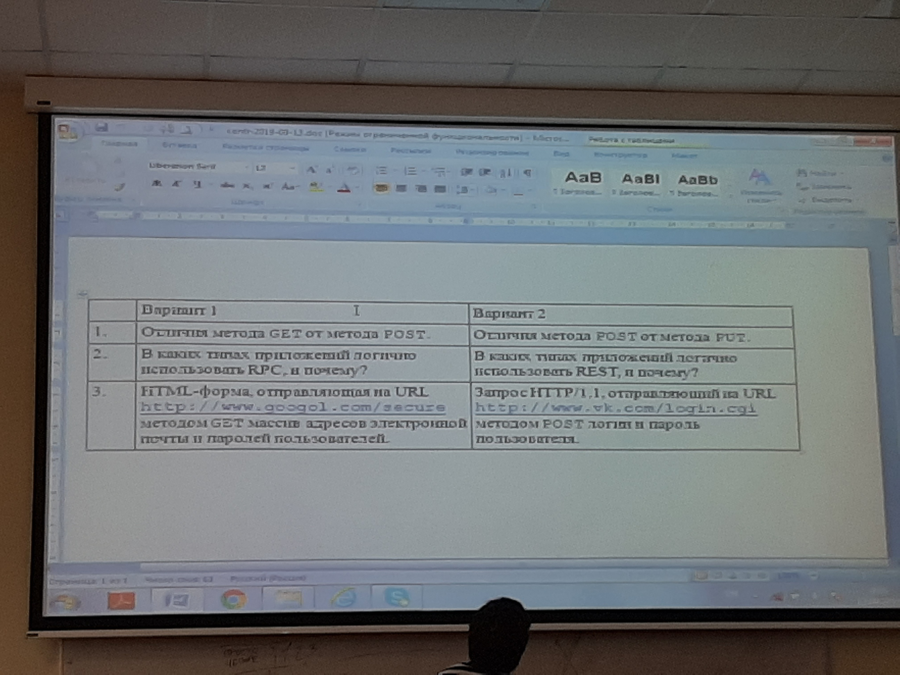
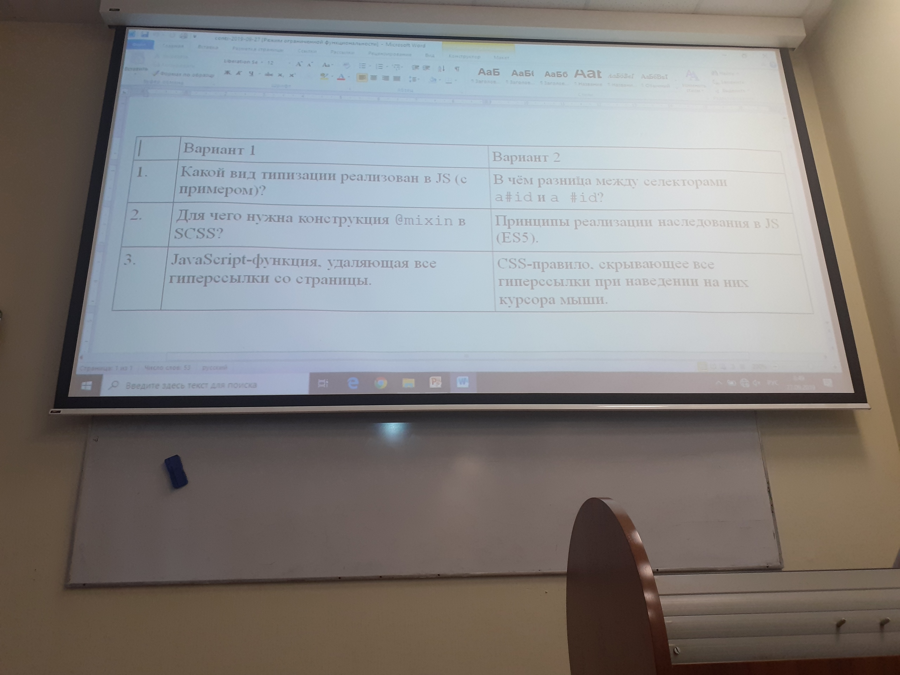
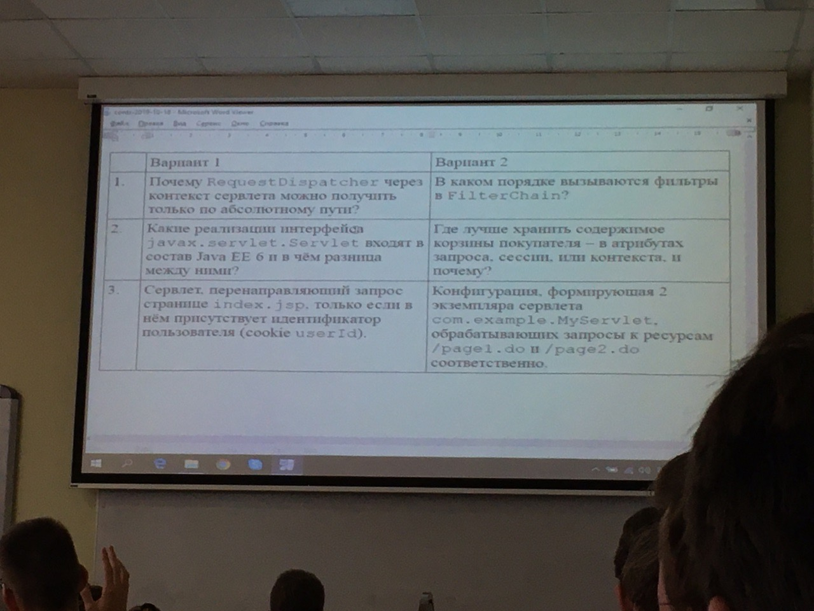
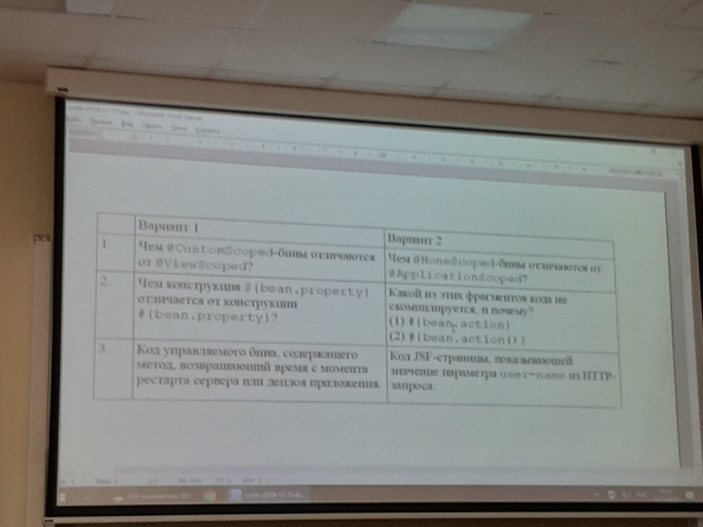
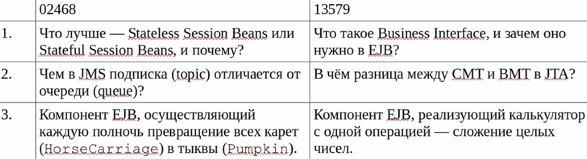

# Веб-программирование
Всю теорию по данным лабораторным работам можно найти вот здесь: [ссылка](https://github.com/band-of-four/cheatsheets/tree/master/Internet-Applications-Development)

+ [Лабораторная работа 1](./Lab_1) `HTML + JS + CSS + PHP`
+ [Лабораторная работа 2](./Lab_2) `JSP + Servlet`
+ [Лабораторная работа 3](./Lab_3) `JSF`
+ [Лабораторная работа 4](./Lab_4) `VUE + Spring`

## Микроконтрольные

  
Тест 1

   

  
Тест 2

   

  
Тест 3

   

  
Тест 4

   

  
Тест 5

   

  
Тест 6

   

## Рубежные тестирования
+ [Рубежка №1 (Теория)](https://github.com/band-of-four/cheatsheets/blob/master/Internet-Applications-Development/ModuleTest1Questions.md)
+ [Рубежка №1 (Практика)](https://github.com/band-of-four/cheatsheets/blob/master/Internet-Applications-Development/ModuleTest1.md)
+ [Рубежка №2](./tests/Рубеж%202.pdf)